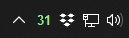
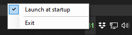

# Memory Usage Monitor
Memory Usage Monitor is a tool that shows how much memory is currently being used. Its purpose is to let the user know that the computer may soon run out of memory.

## Features
- percentage of RAM used shown in the taskbar
- color of the taskbar icon changing as RAM usage gets higher (green if less than 80, orange if less than 90, red if 90 and more)
- application launching at startup (can be toggled by right-clicking the icon in the taskbar)

Preview of the application:

